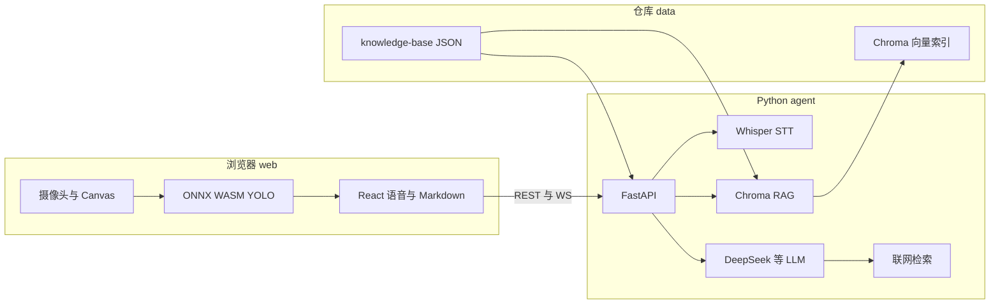

# Live Everything

面向线下陈列与讲解场景的 **AR 商品讲解**：摄像头实时检测物体 → 命中知识库弹出信息面板 → 语音提问 → **Whisper 本地转写** + **DeepSeek（或其他 LLM）生成回答**，本地知识不足时可 **联网检索** 兜底。

**源码仓库：** [github.com/Ruak/Live-Everything](https://github.com/Ruak/Live-Everything)

```bash
git clone https://github.com/Ruak/Live-Everything.git
cd Live-Everything
```

---

## 架构一览



| 路径 | 职责 |
| --- | --- |
| **`web/`** | Vite + React：`@xenova/transformers` 浏览器侧 YOLO、检测结果 AR 叠加、`InfoPanel` 商品卡片、语音录制、`AnswerMarkdown` 渲染模型答复。`/api`、`/ws` 由开发服务器代理到后端。 |
| **`agent/`** | FastAPI：`AgentManager`（多会话）、`RichKnowledgeBase`（结构化 JSON）、Chroma **RAG**、`llm_provider`、`stt_provider`、`web_search`。入口 `agent-server`，配置见 `agent/.env`。 |
| **`data/`** | **唯一知识源**：`knowledge-base/`（标签映射、类目、定制商品 JSON）；**运行时生成**：`data/.chroma/`（向量库）、`data/.rag_source_fingerprint`（启动 ingest 指纹），二者已写入 `data/.gitignore`。 |
| **`models/`** | YOLO ONNX 权重本地目录（构建时拷贝进 `web/dist`）。 |
| **`docs/`** | `prd.md` 等产品与交互说明。 |

---

## 先决条件

- **Node.js ≥ 18**（推荐 20）
- **Python ≥ 3.9**（可与现有 conda 环境共用）
- **麦克风与摄像头**；页面须通过 `http://localhost` 或 `127.0.0.1` 打开，否则浏览器会限制 `getUserMedia`
- **DeepSeek API Key**（可选）：见 [DeepSeek Platform](https://platform.deepseek.com)，未配置时后端可降级为规则/占位逻辑

无需单独安装系统 **ffmpeg**：后端依赖 **imageio-ffmpeg** 自带二进制解码浏览器录制的 WebM。

---

## 目录结构（节选）

```
Live-Everything/
├── agent/
│   ├── pyproject.toml
│   ├── .env.example          # 复制为 .env
│   └── src/agent/
│       ├── main.py           # FastAPI lifespan：加载 KB、按需 RAG ingest、Whisper 预热
│       ├── config.py
│       ├── api/
│       └── core/             # agent_manager · rag · llm · stt · web_search
├── web/
│   ├── vite.config.ts        # /api /ws → localhost:8000
│   └── src/
├── data/
│   ├── knowledge-base/
│   │   ├── config/           # label_mapping · categories · core …
│   │   └── products/custom/ # 定制商品 *.json
│   ├── .chroma/              # 生成，Git 忽略
│   └── .rag_source_fingerprint
├── models/                   # Xenova gelan-c 等
└── docs/
```

---

## 后端启动（agent）

### 安装

**Conda**

```powershell
conda activate ...
cd agent
python -m pip install -U pip
pip install -e .
```

**或独立 venv（Python 3.9–3.13 均可，需满足 pyproject）**

```powershell
cd agent
py -3.11 -m venv .venv
.\.venv\Scripts\Activate.ps1
pip install -e .
```

首次运行会按需下载 Whisper 权重（体量因模型档位而异）。

### 配置

```powershell
Copy-Item .env.example .env
```

常用变量（详见 `.env.example`）：`LLM_PROVIDER`、`DEEPSEEK_*`、`STT_PROVIDER` / `WHISPER_*`、`WEB_SEARCH_*`、`RAG_INGEST_ON_STARTUP`、`RAG_SKIP_IF_SOURCES_UNCHANGED` 等。

### 启动

```powershell
agent-server
```

默认：`http://0.0.0.0:8000`。自检：`curl http://localhost:8000/api/health`。

---

## 前端启动（web）

```powershell
cd web
npm install
npm run dev
```

浏览器访问 **http://localhost:5173**。生产构建：`npm run build`，`vite.config.ts` 会将 `../models` 与 `../data/knowledge-base` 拷入 `dist/`。

若后端非本机 `8000`，可在启动前设置 **`VITE_AGENT_BACKEND=http://主机:端口`**。

---

## 知识与 RAG

- 定制商品：在 **`data/knowledge-base/products/custom/`** 放置 `<product_id>.json`，并在 **`config/label_mapping.json`** 中为检测标签建立映射。
- 向量索引目录：**`data/.chroma/`**。默认启动会对比 **`data/.rag_source_fingerprint`** 与知识文件哈希，若源未变且索引已有数据则跳过全量 ingest；修改 JSON 后可 **`POST /api/rag/ingest/reload`**，或暂时关闭跳过策略见 `.env`。

---

## 端到端自检建议

1. 前端控制台：YOLO **就绪**，商品数量与 `products/custom/` 内 JSON 一致。
2. 摄像头对准映射过的商品 → 弹出侧栏面板。
3. 「语音提问」录音 → 面板问答区出现 **转写 + Markdown 排版** 的答复；后端日志有 `/api/agents/.../audio` 与转写文本。

---

## 常见问题

| 现象 | 处理 |
| --- | --- |
| `语音服务未连接` / `ECONNREFUSED` | 确认 `agent-server` 已监听 8000，且 Vite 代理未被改端口。 |
| `pip install -e .` 报 Python 版本不符 | 使用 **≥ 3.9**，与 `agent/pyproject.toml` 中 `requires-python` 对齐。 |
| Whisper 报错找不到 ffmpeg | `pip install imageio-ffmpeg`（一般已在依赖里）。 |
| 麦克风采不到音 | 使用 localhost；检查浏览器站点权限中的麦克风。 |
| 转写为空 | 查看 `agent/.cache/failed_audio/`；适当提高 `WHISPER_MODEL_SIZE` 或靠近麦克风录长一点。 |

更完整的产品与交互说明见 **`docs/prd.md`**。

---

## 开源与致谢

本项目用于 AR 导购与陈列讲解场景的演示与二次开发。**远程仓库：** [https://github.com/Ruak/Live-Everything](https://github.com/Ruak/Live-Everything)。
